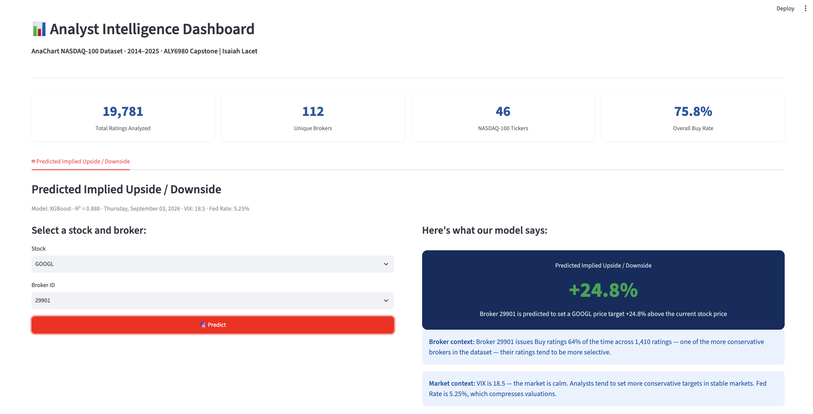
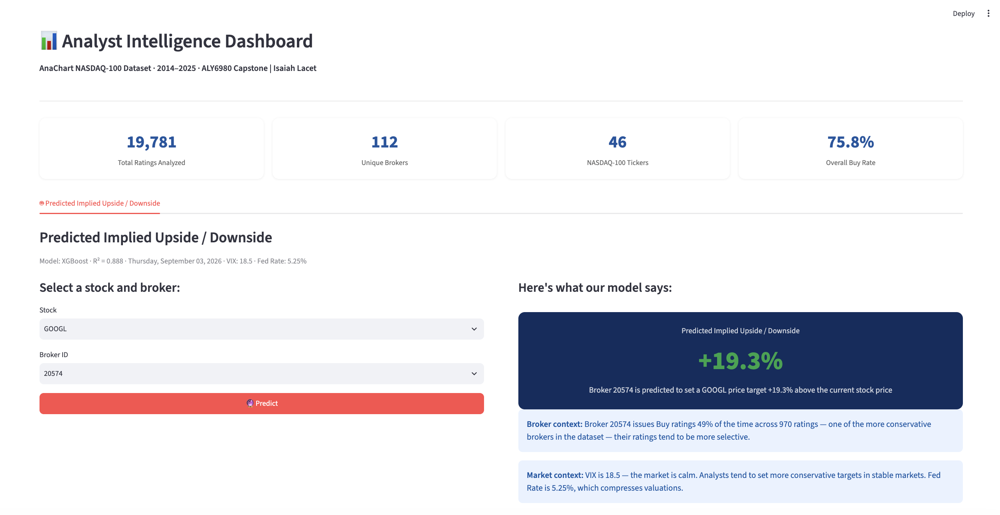

# Anachart's Analyst Intelligence Dashboard

Built on the AnaChart NASDAQ-100 analyst ratings dataset, this is an interactive Streamlit dashboard that normalizes 19,781 sell-side analyst ratings onto a single Buy/Hold/Sell scale and uses a trained XGBoost model to predict the implied upside or downside of a broker's next price target, given the ticker, broker, and current market conditions (VIX, Fed Funds Rate).

Pipeline: Raw AnaChart CSV -> Clean and normalize ratings -> Encode tickers -> Train XGBoost model -> Streamlit app -> Live prediction, driven by real-time VIX and Fed Funds Rate

## Why this project

This dashboard was built as the ALY6980 capstone project for AnaChart, the client that supplied the underlying analyst ratings dataset.

Every broker rates stocks on its own scale ("Outperform," "Overweight," "Strong Buy," "Sector Perform"), so raw analyst ratings data doesn't tell you much on its own: which brokers are historically bullish versus selective, or what to expect from any given broker's next price-target call. Reading that context off the raw CSV means cross-referencing hundreds of rating labels and thousands of historical calls by hand, for every broker and every ticker.

This project replaces that manual read with a normalized dataset and a trained model: ratings are collapsed onto one Buy/Hold/Sell scale across all 112 brokers, and the model translates broker, ticker, and macro conditions into a concrete predicted number, so a new price target can be checked against what the model would expect instead of eyeballed.

## How it works

1. **Prerequisites.** Python 3.9+.
2. **Get the code.** Clone or download this repository, then open a terminal in the project folder.
3. **Install dependencies:**

   ```bash
   python -m venv venv
   source venv/bin/activate        # Windows: venv\Scripts\activate
   pip install -r requirements.txt
   ```

4. **Run it:**

   ```bash
   streamlit run dashboard.py
   ```

   The app opens at `http://localhost:8501`.

Under the hood, `dashboard.py` runs through the same steps every time it starts:

- **Load** (`load_data`): reads `anachart.csv`, maps each broker's raw rating text (e.g. "Outperform," "Overweight," "Strong Buy") onto a simple Buy/Hold/Sell scale via a lookup table, and filters to 2014-2025.
- **Fetch live macro context** (`fetch_macro`): pulls the current VIX from Yahoo Finance and the effective Fed Funds Rate from the FRED CSV endpoint, cached for an hour, falling back to fixed historical averages (VIX 18.5, Fed 5.25%) if either call fails.
- **Predict** (`get_broker_ranking` / the Predict button): feeds broker ID, encoded ticker, current VIX, current Fed rate, and year into the trained XGBoost model (`model.pkl`, encoded with `ticker_encoder.pkl`), which outputs the predicted implied upside/downside (%) of that broker's next price target relative to the current stock price.
- **Narrate**: adds plain-language context underneath the prediction, how bullish or selective the selected broker has historically been, and how current VIX/Fed conditions typically shape analyst target-setting.

## Example predictions

Four screenshots from the "Predicted Implied Upside / Downside" tab, all taken under the same market conditions (VIX 18.5, Fed Funds Rate 5.25%) so only the stock and broker change between them.


**AAPL, Broker 29901, Predicted upside: +16.4%**
Broker 29901 issues Buy ratings 64% of the time across 1,410 ratings, making it a moderately conservative broker. On AAPL, the model predicts a relatively modest implied upside.



**GOOGL, Broker 29901, Predicted upside: +24.8%**
Same broker as above, switched to GOOGL. The prediction jumps roughly 8.4 points higher than the AAPL case, showing the model has learned ticker-specific pricing behavior rather than just applying a flat per-broker offset.



**GOOGL, Broker 20574, Predicted upside: +19.3%**
A more selective broker (49% Buy rate across 970 ratings) on the same ticker, GOOGL. The prediction lands lower than broker 29901's GOOGL prediction, consistent with 20574's more conservative rating history.


**AAPL, Broker 20574, Predicted upside: +5.9%**
The same conservative broker as above, moved back to AAPL. This produces the lowest prediction of the four, showing that broker and ticker effects are compounding, not acting independently.

**Takeaway:** These four predictions all come from the same model and the same normalized Buy/Hold/Sell framework, but the output isn't a fixed number you can read off just the broker or just the ticker. Broker 29901 (a more bullish broker historically, with a 64% Buy rate) predicts +16.4% on AAPL but +24.8% on GOOGL, so even the same broker's prediction shifts by ticker. Broker 20574 (a more selective broker, with a 49% Buy rate) predicts +5.9% on AAPL but +19.3% on GOOGL, the same pattern, at consistently lower levels. Broker and ticker both move the number, and they move it together rather than independently, which is why a single number for "this broker" or "this stock" alone would miss what's actually going on.

## Key metrics

- **Rating normalization**: each broker's raw rating text is mapped to **Buy / Hold / Sell** via a lookup table (e.g. "Outperform," "Overweight," "Strong Buy" all collapse to Buy), so ratings are comparable across brokers that use different scales.
- **Implied upside/downside** = `(price_target_post - close_price) / close_price * 100`, filtered to between -100% and 200% to exclude data errors.
- **Broker Buy rate** = share of a broker's ratings labeled Buy, used as a proxy for how bullish or selective that broker historically is. Broker-level stats are only computed for brokers with at least 50 total ratings, to avoid noise from low-volume brokers.
- **Rating change direction** (Upgrade / Downgrade / Hold) = comparison between a rating's numeric rank (Buy=3, Hold=2, Sell=1) and its prior rating's rank.
- **Prediction inputs**: broker ID, encoded ticker, current VIX, current Fed Funds Rate, and year, is all the trained model needs to produce a prediction.

## Scalability

The dashboard isn't hard-wired to NASDAQ-100 or to this exact dataset. Dropping in a differently-sourced ratings CSV with the same column schema (and retraining `model.pkl` / `ticker_encoder.pkl` against it) extends the same pipeline to a different universe of tickers without restructuring the app. Because the model only takes five inputs (broker, ticker, VIX, Fed rate, year), retraining on more brokers, more tickers, or more recent quarters is a matter of re-running the training step, not redesigning the feature set. Streamlit's caching (`@st.cache_data`, `@st.cache_resource`) also means the app already scales to a larger CSV or model file without any code changes.

## Known limitations

- **No automated tests.** Nothing checks the rating-normalization logic or the model's predictions automatically; correctness currently relies on manual spot-checks like the Example Predictions section above.
- **Static model.** `model.pkl` is a point-in-time snapshot. It isn't retrained automatically as new quarters of ratings arrive, so predictions will drift stale unless someone manually retrains and swaps the pickle file.
- **External API dependency.** Live macro context (VIX from Yahoo Finance, Fed rate from FRED) requires internet access at runtime. If either call fails, the app silently falls back to fixed historical averages without a strong visual warning in the UI.
- **One broker/ticker at a time.** The UI predicts a single broker/ticker pair per click. The model can rank every broker for a given ticker (`get_broker_ranking`), but that full ranking isn't currently surfaced as a leaderboard in the app.

## Future work

- Surface the existing `get_broker_ranking` output as a full leaderboard view, ranking all 112 brokers for a chosen ticker, instead of only single-broker lookups.
- Multi-ticker comparison, letting someone screen a whole watchlist at once rather than one ticker at a time.
- An automated retraining step that reruns when a new quarter of AnaChart data is dropped in, instead of a manually-swapped pickle file.
- Prediction uncertainty (e.g. a confidence interval) alongside the point estimate, since a single percentage implies more precision than an R² = 0.888 model actually has.
- Deploy to Streamlit Community Cloud (or similar) so the dashboard is reachable without running it locally.

## Data source

**Dataset:** AnaChart NASDAQ-100 analyst ratings data. **Granularity:** one record equals one analyst rating action for one ticker. **Coverage:** 2014-2025, 46 NASDAQ-100 tickers, 112 unique brokers, 19,781 total ratings.

## Project structure

```
.
├── dashboard.py          # Streamlit app
├── requirements.txt      # Python dependencies
├── anachart.csv          # AnaChart NASDAQ-100 analyst ratings dataset (2014-2025)
├── model.pkl             # Trained XGBoost model
├── ticker_encoder.pkl    # Fitted ticker label encoder
├── screenshots/          # App screenshots used in this README
└── README.md
```

## Tech stack

Python, Streamlit, pandas, scikit-learn, XGBoost (via joblib), Plotly, yfinance, FRED.

## Author

**Isaiah Lacet** (ALY6980 Capstone)
