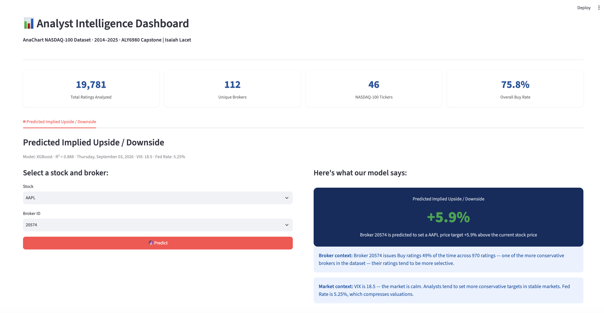

# 📊 Analyst Intelligence Dashboard

Interactive Streamlit dashboard that analyzes 19,781 sell-side analyst ratings across NASDAQ-100 stocks (2014-2025) and predicts implied price-target upside/downside with a trained XGBoost model.

Built as the capstone project for ALY6980, using the AnaChart analyst ratings dataset.

## Example predictions

Four screenshots from the "Predicted Implied Upside / Downside" tab, all taken under the same market conditions (VIX 18.5, Fed Funds Rate 5.25%) so only the stock and broker change between them.


**AAPL · Broker 29901 · Predicted upside: +16.4%**
Broker 29901 issues Buy ratings 64% of the time across 1,410 ratings, making it a moderately conservative broker. On AAPL, the model predicts a relatively modest implied upside.


**GOOGL · Broker 29901 · Predicted upside: +24.8%**
Same broker as above, switched to GOOGL. The prediction jumps roughly 8.4 points higher than the AAPL case, showing the model has learned ticker-specific pricing behavior rather than just applying a flat per-broker offset.


**GOOGL · Broker 20574 · Predicted upside: +19.3%**
A more selective broker (49% Buy rate across 970 ratings) on the same ticker, GOOGL. The prediction lands lower than broker 29901's GOOGL prediction, consistent with 20574's more conservative rating history.



**AAPL · Broker 20574 · Predicted upside: +5.9%**
The same conservative broker as above, moved back to AAPL. This produces the lowest prediction of the four, showing that broker and ticker effects are compounding, not acting independently.

**Takeaway:** across all four predictions, two patterns hold at once. By ticker, GOOGL comes in higher than AAPL for both brokers (+24.8% vs. +16.4% for broker 29901, +19.3% vs. +5.9% for broker 20574), the model treats GOOGL as having more implied upside regardless of who's covering it. By broker, 29901 (the more bullish broker, 64% historical Buy rate) predicts higher upside than 20574 (more selective, 49% Buy rate) on both tickers. Because both effects point the same direction, the highest prediction of the four is GOOGL/29901 (+24.8%) and the lowest is AAPL/20574 (+5.9%). The model isn't just outputting a per-broker or per-ticker average: it combines broker-specific bias *and* stock-specific target-setting behavior, and the two stack rather than cancel out.

## Tech stack

| Layer | Tool |
|---|---|
| App / UI | [Streamlit](https://streamlit.io/) |
| Data wrangling | pandas, numpy |
| Modeling | scikit-learn, XGBoost (via joblib) |
| Charts | Plotly |
| Live macro data | yfinance, FRED |

## Getting started

### Prerequisites

- Python 3.9+

### Installation

```bash
git clone https://github.com/isaiahlacet/nasdaq100-analyst-intelligence.git
cd nasdaq100-analyst-intelligence
python -m venv venv
source venv/bin/activate        # Windows: venv\Scripts\activate
pip install -r requirements.txt
```

### Run it

```bash
streamlit run dashboard.py
```

The app opens at `http://localhost:8501`.

## Data

This repo includes the dataset and trained model artifacts used by the dashboard:

- `anachart.csv`: AnaChart NASDAQ-100 analyst ratings data (2014-2025), with columns including `date`, `ticker`, `company_name`, `analyst_name`, `price_target_prior`, `price_target_post`, `rating_prior`, `rating_post`, `broker_number`, `close_price`
- `model.pkl`: the trained XGBoost model (R² = 0.888) used to predict implied upside/downside
- `ticker_encoder.pkl`: the fitted label encoder used to encode tickers for the model

Once cloned, these files sit in the project root alongside `dashboard.py`, so no extra setup is needed to run the app.

## Project structure

```
.
├── dashboard.py          # Streamlit app
├── requirements.txt      # Python dependencies
├── anachart.csv          # AnaChart NASDAQ-100 analyst ratings dataset (2014-2025)
├── model.pkl             # Trained XGBoost model
├── ticker_encoder.pkl    # Fitted ticker label encoder
├── screenshots/          # App screenshots used in this README
└── README.md
```

## Limitations

- Predictions reflect historical patterns in the 2014-2025 dataset and are not investment advice.
- Live macro data (VIX, Fed rate) depends on external APIs (Yahoo Finance, FRED) and falls back to static averages if those are unreachable.
- The model does not account for company-specific news, earnings surprises, or analyst-specific qualitative factors.

## Author

**Isaiah Lacet** (ALY6980 Capstone)
